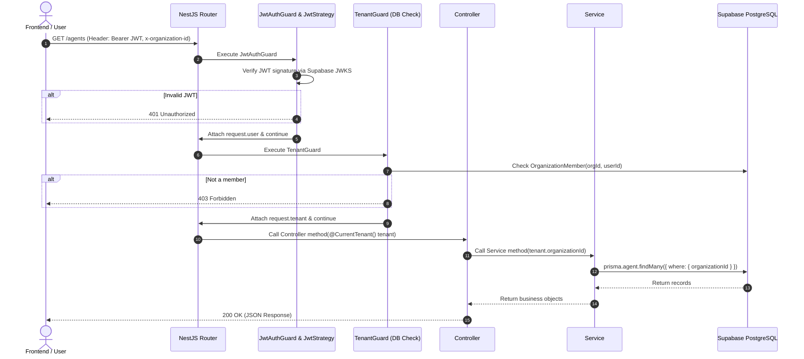

# NestJS for Node.js Developers: Architectural Guide & OOP Deep Dive

> This guide is tailored for Node.js/Express developers transitioning to NestJS. It translates Express concepts into NestJS Object-Oriented Programming (OOP) patterns and explains the exact modules implemented in this codebase.

---

## Table of Contents
1. [The Mental Shift: Express vs. NestJS](#1-the-mental-shift-express-vs-nestjs)
2. [Core OOP Concepts in NestJS](#2-core-oop-concepts-in-nestjs)
3. [Deep Dive into Implemented Modules](#3-deep-dive-into-implemented-modules)
   - [DatabaseModule & PrismaService](#31-databasemodule--prismaskservice)
   - [AuthModule & JWT Strategy (Supabase Auth)](#32-authmodule--jwt-strategy-supabase-auth)
   - [TenantModule & Multi-Tenancy Guard](#33-tenantmodule--multi-tenancy-guard)
4. [The End-to-End Request Lifecycle](#4-the-end-to-end-request-lifecycle)
5. [Complete Practical Example: Building the `AgentsModule`](#5-complete-practical-example-building-the-agentsmodule)
6. [Quick Reference Cheat Sheet](#6-quick-reference-cheat-sheet)

---

## 1. The Mental Shift: Express vs. NestJS

If you know Express, you already know 90% of what happens behind the scenes. NestJS actually uses Express under the hood by default, but organizes your code using OOP and architectural patterns instead of loose functions.

| Concept | Express (Procedural / Functional) | NestJS (Object-Oriented & Modular) |
| :--- | :--- | :--- |
| **Routing / Endpoints** | `router.get('/users', handlerFn)` | `@Controller('users')` class with `@Get()` methods |
| **Business Logic** | Helper functions / utility files | `@Injectable()` Service classes |
| **Middleware / Auth** | `app.use(authMiddleware)` with `next()` | `@UseGuards(JwtAuthGuard)` implementing `CanActivate` |
| **Database Connection** | Manual singleton import `import db from './db'` | Dependency Injection: `constructor(private prisma: PrismaService)` |
| **Code Organization** | Custom folder conventions | `@Module({ controllers, providers, imports, exports })` |
| **Request Data** | `req.body`, `req.params`, `req.user` | `@Body()`, `@Param()`, `@CurrentUser()`, `@CurrentTenant()` |

---

## 2. Core OOP Concepts in NestJS

### 2.1 Inversion of Control (IoC) & Dependency Injection (DI)
In plain Node.js, if Class A needs Class B, Class A creates Class B directly:
```typescript
// ❌ Traditional Tight Coupling (Hard to test, hard to maintain)
class UserService {
  private db = new DatabaseClient(); // Hardcoded dependency
}
```

In NestJS, classes **ask** for what they need through their constructor. NestJS's runtime (the IoC container) creates instances and injects them automatically:
```typescript
// ✅ Dependency Injection (Loose coupling, testable)
@Injectable()
export class UserService {
  constructor(private readonly prisma: PrismaService) {} // Nest injects PrismaService automatically
}
```

### 2.2 Decorators (Metadata Annotation)
Decorators (starting with `@`) attach metadata to classes, methods, or parameters. They tell NestJS what role a class plays:
- `@Module()` defines an encapsulated module boundary.
- `@Controller('agents')` tells Nest to map HTTP requests starting with `/agents` to this class.
- `@Injectable()` registers a class with Nest's Dependency Injection system.
- `@UseGuards()` attaches authorization gates to routes.

### 2.3 Polymorphism via Interfaces
NestJS uses TypeScript interfaces to enforce contracts. For example:
- `implements OnModuleInit`: Guarantees a class has an `onModuleInit()` method called when the app starts.
- `implements CanActivate`: Guarantees a Guard has a `canActivate(context)` method returning `boolean`.

---

## 3. Deep Dive into Implemented Modules

Here is how each module currently implemented in `apps/api/src` works:

```
apps/api/src/
├── app.module.ts              # Root module importing everything
├── database/
│   ├── database.module.ts     # Global database module
│   └── prisma.service.ts      # PrismaClient wrapped as an injectable service
├── auth/
│   ├── auth.module.ts         # Passport & JWT configuration
│   ├── jwt.strategy.ts        # Passport Strategy verifying Supabase JWTs
│   ├── jwt-auth.guard.ts      # Auth Guard protecting routes
│   └── current-user.decorator.ts # Param decorator extracting request.user
└── tenant/
    ├── tenant.module.ts       # Tenant module
    ├── tenant.types.ts        # Tenant context types
    ├── tenant.guard.ts        # Verifies organization membership in PostgreSQL
    └── current-tenant.decorator.ts # Param decorator extracting request.tenant
```

---

### 3.1 `DatabaseModule` & `PrismaService`

#### `prisma.service.ts`
```typescript
import { Injectable, OnModuleInit, OnModuleDestroy } from '@nestjs/common';
import { PrismaClient } from '@ai-workforce/database';

@Injectable()
export class PrismaService extends PrismaClient implements OnModuleInit, OnModuleDestroy {
  async onModuleInit() {
    await this.$connect();
  }

  async onModuleDestroy() {
    await this.$disconnect();
  }
}
```

**OOP Concepts at Work:**
1. **Inheritance (`extends PrismaClient`)**: `PrismaService` inherits all Prisma database methods (`this.organization.findMany()`, `this.agent.create()`, etc.).
2. **Lifecycle Hooks (`implements OnModuleInit, OnModuleDestroy`)**: 
   - `onModuleInit`: Connects to PostgreSQL automatically when Nest boots up.
   - `onModuleDestroy`: Safely closes PostgreSQL connection pool on shutdown.

#### `database.module.ts`
```typescript
import { Global, Module } from '@nestjs/common';
import { PrismaService } from './prisma.service';

@Global()
@Module({
  providers: [PrismaService],
  exports: [PrismaService],
})
export class DatabaseModule {}
```
**Key Point**: `@Global()` makes `PrismaService` available across **all** modules in the application without having to re-import `DatabaseModule` in every feature module.

---

### 3.2 `AuthModule` & JWT Strategy (Supabase Auth)

#### How Authentication Works
1. Frontend signs in via Supabase and obtains a JWT access token.
2. Frontend sends requests with: `Authorization: Bearer <SUPABASE_JWT_TOKEN>`.
3. `JwtStrategy` intercepts the token, fetches Supabase's public keys via JWKS (`.well-known/jwks.json`), and cryptographically validates the token.
4. When valid, the decoded user payload is attached to `request.user`.

#### `jwt.strategy.ts` (Strategy Pattern)
```typescript
@Injectable()
export class JwtStrategy extends PassportStrategy(Strategy, 'jwt') {
  constructor(configService: ConfigService) {
    const supabaseUrl = configService.get<string>('SUPABASE_URL');
    super({
      jwtFromRequest: ExtractJwt.fromAuthHeaderAsBearerToken(),
      ignoreExpiration: false,
      algorithms: ['ES256', 'RS256', 'HS256'],
      secretOrKeyProvider: passportJwtSecret({
        cache: true,
        rateLimit: true,
        jwksRequestsPerMinute: 10,
        jwksUri: `${supabaseUrl}/auth/v1/.well-known/jwks.json`,
      }),
    });
  }

  async validate(payload: any): Promise<AuthenticatedUser> {
    return {
      userId: payload.sub,
      email: payload.email,
      role: payload.role,
      appMetadata: payload.app_metadata || {},
      userMetadata: payload.user_metadata || {},
    };
  }
}
```

#### `jwt-auth.guard.ts`
```typescript
@Injectable()
export class JwtAuthGuard extends AuthGuard('jwt') {}
```
Applying `@UseGuards(JwtAuthGuard)` on any Controller or method automatically returns `401 Unauthorized` if the token is missing or invalid.

#### `current-user.decorator.ts`
Instead of doing `req.user` manually in handlers, you use the decorator:
```typescript
@Get('me')
getProfile(@CurrentUser() user: AuthenticatedUser) {
  return user;
}
```

---

### 3.3 `TenantModule` & Multi-Tenancy Guard

Our system is **multi-tenant**: users belong to Organizations, and all data (Agents, Tasks, Documents) must be strictly isolated by `organizationId`.

#### `tenant.guard.ts` (Authorization & Tenant Boundary)
```typescript
@Injectable()
export class TenantGuard implements CanActivate {
  constructor(private readonly prisma: PrismaService) {}

  async canActivate(context: ExecutionContext): Promise<boolean> {
    const request = context.switchToHttp().getRequest();
    const user = request.user as AuthenticatedUser;

    if (!user?.userId) {
      throw new ForbiddenException('User context missing');
    }

    // 1. Get organization ID from Header or Route Param
    const organizationId =
      (request.headers['x-organization-id'] as string) ||
      request.params.organizationId;

    if (!organizationId) {
      throw new BadRequestException('Organization ID header (x-organization-id) or param is required');
    }

    // 2. Query DB: Is this user an active member of this organization?
    const membership = await this.prisma.organizationMember.findUnique({
      where: {
        organizationId_userId: {
          organizationId,
          userId: user.userId,
        },
      },
      include: { organization: true },
    });

    if (!membership) {
      throw new ForbiddenException('Access denied: You are not a member of this organization');
    }

    // 3. Attach tenant context to the request
    request.tenant = {
      organizationId: membership.organizationId,
      role: membership.role,
      organization: membership.organization,
      membership,
    };

    return true;
  }
}
```

---

## 4. The End-to-End Request Lifecycle

Here is the exact step-by-step path every HTTP request takes through the architecture:



---

## 5. Complete Practical Example: Building the `AgentsModule`

Let's build a complete feature module from scratch following all the patterns above.

### Step 1: Create Data Transfer Object (DTO)
DTOs define the shape of incoming request bodies and validate them.

Create `apps/api/src/agents/dto/create-agent.dto.ts`:
```typescript
import { AgentType } from '@ai-workforce/database';

export class CreateAgentDto {
  name: string;
  description?: string;
  type?: AgentType;
  systemPrompt?: string;
}
```

---

### Step 2: Create the Service (Business Logic)
Create `apps/api/src/agents/agents.service.ts`:
```typescript
import { Injectable, NotFoundException } from '@nestjs/common';
import { PrismaService } from '../database/prisma.service';
import { CreateAgentDto } from './dto/create-agent.dto';

@Injectable()
export class AgentsService {
  constructor(private readonly prisma: PrismaService) {}

  // All queries are strictly scoped to organizationId
  async findAllByOrganization(organizationId: string) {
    return this.prisma.agent.findMany({
      where: { organizationId },
      orderBy: { createdAt: 'desc' },
    });
  }

  async findOne(organizationId: string, id: string) {
    const agent = await this.prisma.agent.findFirst({
      where: { id, organizationId },
    });

    if (!agent) {
      throw new NotFoundException(`Agent with ID "${id}" not found`);
    }

    return agent;
  }

  async create(organizationId: string, dto: CreateAgentDto) {
    return this.prisma.agent.create({
      data: {
        name: dto.name,
        description: dto.description,
        type: dto.type,
        systemPrompt: dto.systemPrompt,
        organizationId, // Enforces multi-tenant isolation
      },
    });
  }

  async delete(organizationId: string, id: string) {
    await this.findOne(organizationId, id); // Verify existence in tenant
    return this.prisma.agent.delete({
      where: { id },
    });
  }
}
```

---

### Step 3: Create the Controller (HTTP Endpoints)
Create `apps/api/src/agents/agents.controller.ts`:
```typescript
import {
  Controller,
  Get,
  Post,
  Delete,
  Body,
  Param,
  UseGuards,
} from '@nestjs/common';
import { JwtAuthGuard } from '../auth/jwt-auth.guard';
import { TenantGuard } from '../tenant/tenant.guard';
import { CurrentTenant } from '../tenant/current-tenant.decorator';
import { TenantContext } from '../tenant/tenant.types';
import { AgentsService } from './agents.service';
import { CreateAgentDto } from './dto/create-agent.dto';

@Controller('agents')
@UseGuards(JwtAuthGuard, TenantGuard) // Protected by Auth + Tenant guards
export class AgentsController {
  constructor(private readonly agentsService: AgentsService) {}

  @Get()
  async getAgents(@CurrentTenant() tenant: TenantContext) {
    return this.agentsService.findAllByOrganization(tenant.organizationId);
  }

  @Get(':id')
  async getAgent(
    @CurrentTenant() tenant: TenantContext,
    @Param('id') id: string,
  ) {
    return this.agentsService.findOne(tenant.organizationId, id);
  }

  @Post()
  async createAgent(
    @CurrentTenant() tenant: TenantContext,
    @Body() createAgentDto: CreateAgentDto,
  ) {
    return this.agentsService.create(tenant.organizationId, createAgentDto);
  }

  @Delete(':id')
  async deleteAgent(
    @CurrentTenant() tenant: TenantContext,
    @Param('id') id: string,
  ) {
    return this.agentsService.delete(tenant.organizationId, id);
  }
}
```

---

### Step 4: Create the Module
Create `apps/api/src/agents/agents.module.ts`:
```typescript
import { Module } from '@nestjs/common';
import { AgentsController } from './agents.controller';
import { AgentsService } from './agents.service';
import { TenantModule } from '../tenant/tenant.module';

@Module({
  imports: [TenantModule], // Provides TenantGuard
  controllers: [AgentsController],
  providers: [AgentsService],
  exports: [AgentsService],
})
export class AgentsModule {}
```

---

### Step 5: Register into Root `AppModule`
In `apps/api/src/app.module.ts`, add `AgentsModule` to `imports`:
```typescript
import { Module } from '@nestjs/common';
import { ConfigModule } from '@nestjs/config';
import { DatabaseModule } from './database/database.module';
import { AuthModule } from './auth/auth.module';
import { TenantModule } from './tenant/tenant.module';
import { AgentsModule } from './agents/agents.module'; // 👈 Add this

@Module({
  imports: [
    ConfigModule.forRoot({ isGlobal: true, envFilePath: '.env' }),
    DatabaseModule,
    AuthModule,
    TenantModule,
    AgentsModule, // 👈 Register here
  ],
  controllers: [AppController],
  providers: [AppService],
})
export class AppModule {}
```

---

## 6. Quick Reference Cheat Sheet

| Task | How to do it in NestJS |
| :--- | :--- |
| **Get Query Params** (`/agents?type=HR`) | `@Query('type') type: string` |
| **Get URL Params** (`/agents/:id`) | `@Param('id') id: string` |
| **Get Request Body** (POST/PUT payload) | `@Body() body: CreateAgentDto` |
| **Get Custom Headers** (`x-custom-id`) | `@Headers('x-custom-id') headerVal: string` |
| **Throw 404 Not Found** | `throw new NotFoundException('Message')` |
| **Throw 400 Bad Request** | `throw new BadRequestException('Invalid data')` |
| **Throw 401 Unauthorized** | `throw new UnauthorizedException('Token invalid')` |
| **Throw 403 Forbidden** | `throw new ForbiddenException('Access denied')` |
| **Return HTTP 201 Created** | Default for `@Post()` routes |
| **Change Status Code** | `@HttpCode(HttpStatus.NO_CONTENT)` |
